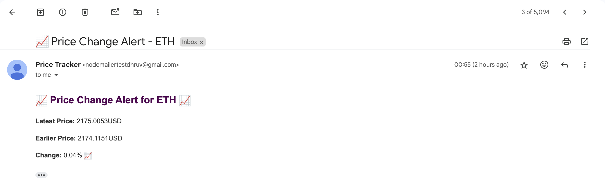
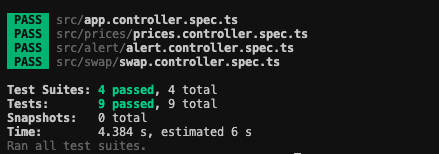

# Blockchain Price Tracker

A powerful and scalable blockchain price tracking service built with Nest.js. This application monitors cryptocurrency prices, provides customizable alerts, and offers swap rate calculations—all wrapped up in a clean, modular codebase.

## Overview

This project is designed to:
- **Monitor Prices**: Automatically save the price of Ethereum and Polygon every 5 minutes.
- **Alert Users**: Send an email alert to `hyperhire_assignment@hyperhire.in` if the price of a chain increases by more than 3% compared to its price one hour ago.
- **Historical Data Access**: Provide a REST API to retrieve hourly price data for the past 24 hours.
- **Custom Price Alerts**: Allow users to set custom alerts for specific prices on different blockchains.
- **Swap Calculation**: Calculate ETH to BTC swap rates in real-time with transparent fee calculations (0.03%).

## Features

### 🕒 Automated Price Tracking
- Collects Ethereum and Polygon price data every 5 minutes.
- Stores historical data in a PostgreSQL database.
- Uses MikroORM for an efficient and clean data model.

### 📈 Price Alert System
- **Automatic Notifications**: Sends an email when a chain's price increases by more than 3% compared to one hour ago.
- **Custom Alerts**: Users can set price alerts (e.g., alert when Ethereum hits $1000) and receive notifications.

### 🔄 Swap Rate Calculator
- Calculates ETH to BTC conversion rates in real-time.
- Transparent fee calculation (0.03% fee).
- Returns both the amount received and fee details (in wei and dollar values).

### 📊 Historical Data API
- RESTful endpoints for retrieving hourly price data (within the past 24 hours).
- Fully documented API using Swagger.

## Technical Stack

- **Backend**: Nest.js with TypeScript
- **Database**: PostgreSQL with MikroORM
- **Blockchain Data**: Integration with Moralis or Solscan API
- **Email Service**: MailerSend for sending alerts
- **Documentation**: Swagger for API documentation
- **Containerization**: Docker and Docker Compose for easy deployment
- **Testing**: Jest for unit and integration testing

## API Endpoints

### Price Data
- `GET /prices/:tokenAddress`  
  Retrieve historical price data for a specific token.

### Price Alerts
- `POST /alert`  
  Create a new price alert.
- `GET /alert/email/:email`  
  Get all alerts for a specific email address.
- `GET /alert/id/:id`  
  Get a specific alert by ID.

### Swap Rates
- `GET /swap/:tokenAddress`  
  Calculate swap rates between tokens (ETH to BTC conversion).

## Running the Application

### Prerequisites
- Docker and Docker Compose

### Setup Steps

1. **Clone the Repository**
    ```bash
    git clone https://github.com/yourusername/blockchain-price-tracker.git
    cd blockchain-price-tracker
    ```

2. **Copy Environment Example Files**
    ```bash
    cp .env.example .env
    cp .env.example.db .env.db
    ```

3. **Configure Environment Variables** in `.env`:
    ```
    PORT=5050
    MORALIS_API_KEY='your_moralis_api_key'
    MAILERSEND_API_KEY='your_mailersend_api_key'
    NODEMAILER_EMAIL='your_email@example.com'
    NODEMAILER_PASSWORD='your_email_password'
    ```

4. **Configure Database Variables** in `.env.db`:
    ```
    POSTGRES_USER=myuser
    POSTGRES_PASSWORD=mypassword
    POSTGRES_DB=mydatabase
    ```

5. **Start the Application** with Docker Compose:
    ```bash
    docker compose up --build
    ```

6. **Access the Application:**
    - **API Base URL**: [http://13.232.183.101:5050](http://13.232.183.101:5050)
    - **Swagger Documentation**: [http://13.232.183.101:5050/api](http://13.232.183.101:5050/api)

## Architecture

- **Cron Service**: Handles scheduled tasks like price data collection and alert checks.
- **Price Module**: Manages price data storage and retrieval.
- **Alert Module**: Processes alert creation and email notifications.
- **Swap Module**: Calculates exchange rates and fee details.
- **Moralis/Solscan Service**: Interfaces with blockchain APIs for real-time data.

## Sample Email Notification

Below is a screenshot of a sample email notification sent when a price alert condition is met:



## Testing

```bash
npm run test
```



## Deployment

For local development and testing, run the entire stack using Docker Compose:
```bash
docker compose up --build
